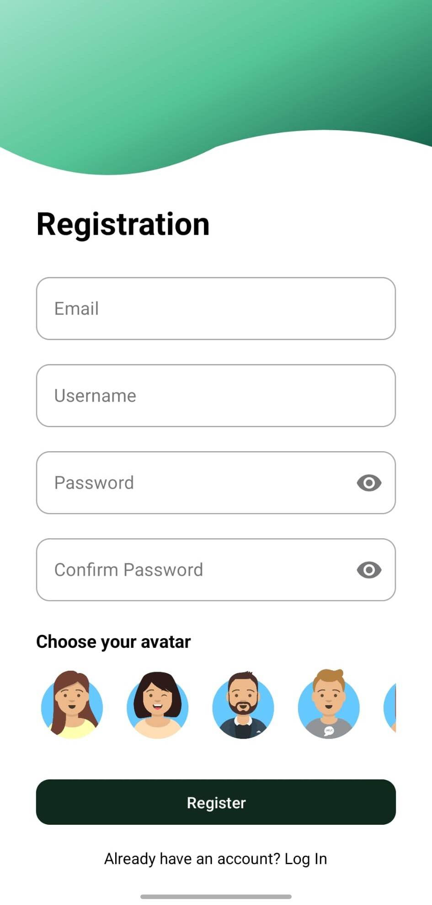

# Habit Quest 
Academic project for the Mobile Applications course at Faculty of Technical Sciences, University of Novi Sad 

## About Project 
HabitQuest is an Android application developed in Java that gamifies habit and goal tracking using RPG mechanics allowing users to complete daily tasks, earn XP, collect rewards, and level up through boss battles and achievements.

## Used Tools and Libraries 
► Android Studio   
► Firebase Firestore   
► SQLite   
► LottieFiles   
► ZXing   
► MPAndroidChart  

### Authors
► Ana Edelinski  
► Masa Mastilovic

## Screenshots

  
  
  

  
  
  

  
  
  

